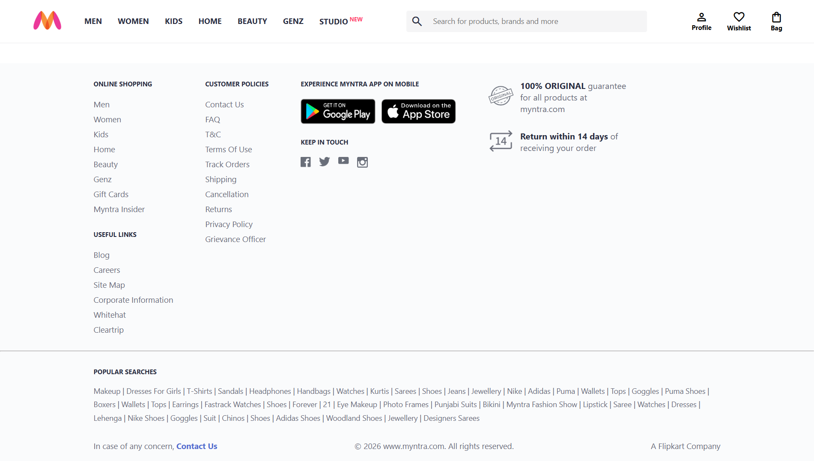

# Myntra Clone

A static frontend clone of the Myntra homepage, built from scratch using **HTML5** and **CSS3** without frameworks, libraries, or JavaScript.

**Live Demo:** [myntra-clone-ten-pink.vercel.app](https://myntra-clone-ten-pink.vercel.app)

**Repository:** https://github.com/Prakhar4real/myntra-clone

---

## Overview

This project recreates the Myntra homepage with a focus on accurately replicating the layout and structure of a modern e-commerce website using only HTML5 and CSS3. Rather than simply matching the visual design, the project emphasizes clean semantic markup, well-organized layouts, responsive design principles, and the thoughtful use of Flexbox to build reusable and maintainable user interfaces.


Every layout was implemented manually using Flexbox without relying on pre-built UI frameworks or component libraries.

JavaScript has been intentionally omitted from the current version. Interactive features will be added in future updates after completing JavaScript.

---

## Features

**Navigation**
- Fixed header that remains anchored during scroll
- Full navigation menu with department links
- Integrated search bar
- Icon-based actions for profile, wishlist, and bag using Google Material Symbols

**Hero Section**
- Full-width promotional banner
- Responsive promotional banner that scales across desktop viewports

**Shop by Category**
- Multi-row category grid built with Flexbox and `flex-wrap`
- Visual layout matches Myntra's original row structure, including the asymmetric last row

**Product Sections**
- Horizontally arranged product cards across multiple themed sections

**Footer**
- Four-column layout covering shopping links, customer policies, app download badges, and trust indicators
- Includes popular searches section and bottom copyright bar

---

## Tech Stack

| Layer | Technology |
|--------|------------|
| Markup | HTML5 |
| Styling | CSS3 |
| Layout | Flexbox |
| Icons | Google Material Symbols |
| Version Control | Git |
| Deployment | Vercel |

---

## Project Structure

```
Myntra-Clone/
├── Assets/
│   └── Screenshots/
├── CSS/
│   └── index.css
├── Images/
├── index.html
└── README.md
```

---

## Screenshots

### Homepage

.png)

### Shop by Category

.png)
.png)

### Footer



---

## Getting Started

This is a static project. No build tools or dependencies are required.

```bash
git clone https://github.com/Prakhar4real/myntra-clone.git
cd myntra-clone
```

Open `index.html` directly in a browser, or use a local development server:

```bash
# Using VS Code Live Server extension
# Right-click index.html → Open with Live Server

# Or using Python
python -m http.server 8000
```

---

## Project Status

Static frontend completed using HTML5 and CSS3.

JavaScript functionality and additional interactive features are planned for future updates.

---

## Future Improvements

The following features are planned after completing JavaScript:

- Image carousel with auto-sliding functionality
- Search bar with live filtering
- Wishlist toggle on product cards
- Shopping cart with item count
- Responsive mobile navigation menu
- Individual product pages
- Improved responsiveness across breakpoints

---

## Author

**Prakhar**

- **GitHub:** https://github.com/Prakhar4real
- **LinkedIn:** https://www.linkedin.com/in/workprakhardwivedi/